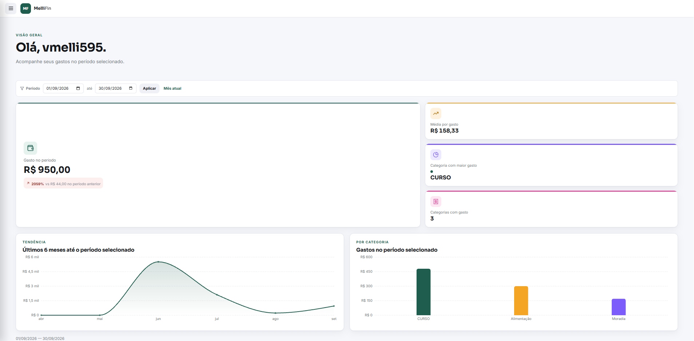
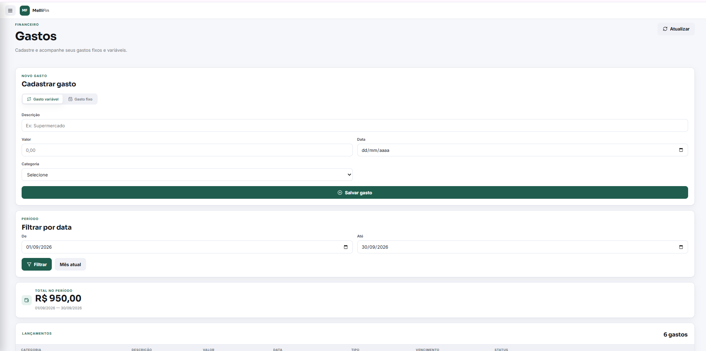
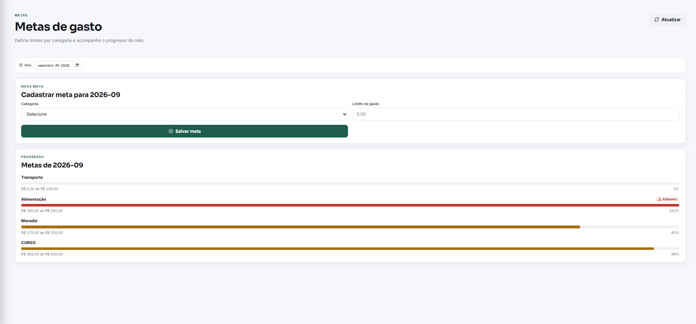
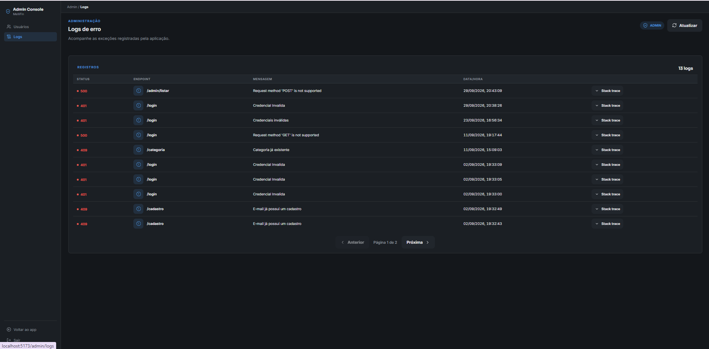

# Controle de Gastos

API REST para controle de gastos pessoais, desenvolvida como projeto de portfólio para praticar back end com Java e Spring Boot.

O usuário se cadastra, registra gastos fixos e variáveis, organiza por categorias, define metas mensais por categoria e acompanha um dashboard com o total gasto no período.

## Demonstração

> **Sobre a interface:** o front end mostrado abaixo foi gerado com auxílio de IA, apenas para visualizar a API funcionando de forma prática. O foco deste projeto é o back end (Java, Spring Boot e Spring Security). O código da interface não está incluído neste repositório.

### Dashboard



Total gasto no período, média por gasto, comparação com o período anterior, categoria com maior gasto, tendência dos últimos 6 meses e gastos por categoria.

### Gastos



Cadastro de gasto fixo ou variável, filtro por período e lista de lançamentos.

### Metas



Limite por categoria e mês, com o progresso do que já foi gasto e a indicação de quando o limite é ultrapassado.

### Logs de erro (perfil administrador)



Erros registrados pela aplicação, com endpoint, mensagem, data e hora e stack trace.

## Tecnologias

| Área | Tecnologia |
|---|---|
| Linguagem | Java 17 |
| Framework | Spring Boot (Web MVC, Data JPA, Validation) |
| Segurança | Spring Security, JWT (jjwt 0.12.6), BCrypt |
| Banco de dados | PostgreSQL 15 |
| Documentação da API | Swagger / OpenAPI (springdoc) |
| Build | Maven (Maven Wrapper incluso) |
| Containers | Docker e Docker Compose |

## Funcionalidades

- Cadastro e login de usuários, com autenticação por token JWT e senhas criptografadas com BCrypt.
- Dois perfis de acesso: `USER` e `ADMIN`. Cada usuário acessa apenas os próprios dados.
- Gastos fixos e variáveis, com edição, listagem e exclusão lógica (o gasto é desativado, não apagado).
- Categorias de gasto por usuário.
- Metas mensais por categoria, com o progresso do que já foi gasto e a indicação de quando o limite é ultrapassado.
- Dashboard com o total gasto no período.
- Tratamento centralizado de exceções, com respostas HTTP padronizadas.
- Registro de erros no banco de dados, consultável pelo administrador.
- Área administrativa: ativar e desativar usuários, listar usuários e consultar os logs de erro.

## Como executar

### Pré-requisitos

- Docker e Docker Compose instalados.
- Para rodar sem Docker: Java 17 e PostgreSQL.

### 1. Clonar o repositório

```bash
git clone <url-do-repositorio>
cd controle-gastos-port
```

### 2. Criar o arquivo de configuração

O arquivo `src/main/resources/application.properties` não é versionado, porque contém a chave secreta do JWT. Copie o modelo e ajuste os valores:

```bash
cp src/main/resources/application.properties.example src/main/resources/application.properties
```

No Windows (PowerShell):

```powershell
Copy-Item src/main/resources/application.properties.example src/main/resources/application.properties
```

Depois, edite o arquivo e troque `jwt.secret` por uma chave própria, com pelo menos 32 caracteres.

### 3. Subir com Docker

```bash
docker compose up --build
```

Isso sobe o PostgreSQL (porta 5432) e a API (porta 8080).

### Rodar sem Docker

1. Crie no PostgreSQL um banco chamado `controle_gastos`.
2. Ajuste usuário e senha em `application.properties`, se forem diferentes do padrão.
3. Execute:

```bash
./mvnw spring-boot:run
```

## Documentação da API (Swagger)

Com a aplicação rodando, acesse:

```
http://localhost:8080/swagger-ui.html
```

## Autenticação

1. Cadastre um usuário em `POST /cadastro`.
2. Faça login em `POST /login` e copie o token JWT retornado.
3. Nas demais requisições, envie o token no cabeçalho:

```
Authorization: Bearer <token>
```

Requisições sem token, ou com token inválido ou expirado, recebem `401 Unauthorized`. Um usuário autenticado sem permissão para a rota recebe `403 Forbidden`.

## Endpoints

| Método | Rota | Acesso |
|---|---|---|
| POST | `/cadastro` | Público |
| POST | `/login` | Público |
| GET | `/login/perfil` e `/perfil` | Autenticado |
| POST | `/categoria` | USER, ADMIN |
| GET | `/categoria/listar` | USER, ADMIN |
| DELETE | `/categoria/excluir` | Autenticado |
| POST | `/gasto/cadastrar-gasto-fixo` | USER, ADMIN |
| POST | `/gasto/cadastrar-gasto-variavel` | USER, ADMIN |
| GET | `/gasto/listar-gasto` | Autenticado |
| PUT | `/editar/gasto/{id}` | USER, ADMIN |
| PATCH | `/gasto/{id}/desativar` | USER, ADMIN |
| POST | `/meta/cadastrar-meta` | USER, ADMIN |
| GET | `/meta/progresso-meta` | USER, ADMIN |
| GET | `/dashboard` | USER, ADMIN |
| PATCH | `/admin/ativar` e `/admin/desativar` | ADMIN |
| GET | `/admin/listar` | ADMIN |
| GET | `/admin/logs` | ADMIN |

Os detalhes de cada requisição (corpo, parâmetros e respostas) estão no Swagger.

## Estrutura do projeto

O código é organizado por funcionalidade, e cada uma segue a separação em camadas (controller, service, repository, model e DTOs):

```
src/main/java/com/victor/controle_gastos_port/
├── admin/        área administrativa
├── categoria/    categorias de gasto
├── config/       segurança, JWT e tratamento global de exceções
├── dashboard/    consultas do dashboard
├── gasto/        gastos fixos e variáveis
├── logs/         registro de erros
├── meta/         metas mensais por categoria
└── usuario/      cadastro e login
```

## Decisões de projeto

- [Agente de IA no Controle de Gastos](docs/DECISAO-AGENTE-IA.md): análise dos níveis estratégico, tático e operacional e a decisão de adiar a funcionalidade.

## Próximos passos

- Testes automatizados (unitários e de integração).
- Migrations de banco de dados com Flyway, no lugar de `ddl-auto=update`.
- Mensagem de orientação ao usuário (sugerindo economia) quando uma meta for ultrapassada, por regra de negócio.

## Autor

Victor Augusto de Carvalho Melli — estudante de Sistemas de Informação (Uninove).
